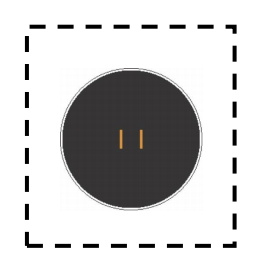
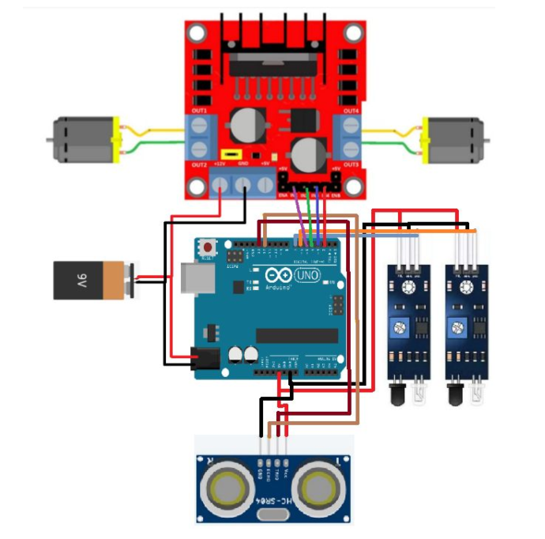
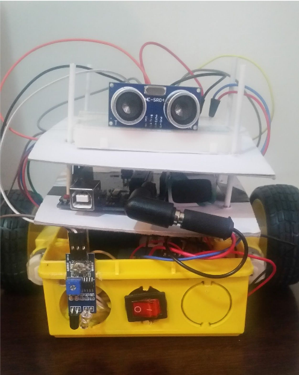

<!-- PROJECT LOGO -->
 

  

  <h3 align="center">Sumô Robô</h3>

  

    Campeonato de sumô entre robôs!
     

<!-- ABOUT THE PROJECT -->
## Sobre o projeto

O projeto do robô sumô foi desenvolvido como forma de avaliação das habilidades com a pinagem de sistemas embarcados, em um formato competitivo que requer pensamento criativo para a implementação da melhor estratégia de combate.

O código foi projetado em linguagem C com acesso direto aos registradores do Arduino Uno, que foram mapeados diretamente em:

* 2 motores DC 3-6V
* 2 sensores infravermelho IR
* 1 sensor ultrassônico HC-SR04
* 1 driver motor ponte-H L298N 

É possível visualizar o mapeamento da pinagem no `Arduino` pelo seguinte diagrama de conexões:

O robô foi carinhosamente apelidado de `WALL·E`.

